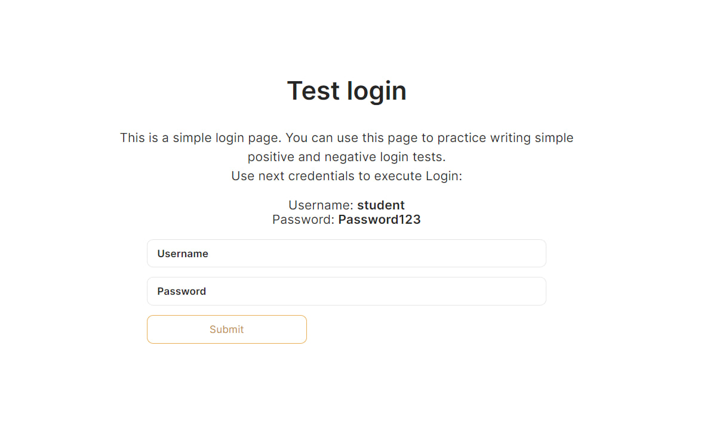

<h1 align="center"><a href="https://vladimirolishevsky.github.io/demoSeleniumProject/">Test Log in form</a></h1>

This is a simple login page. You can use this page to practice writing simple positive and negative login tests.

For run selenium test use `yarn test`